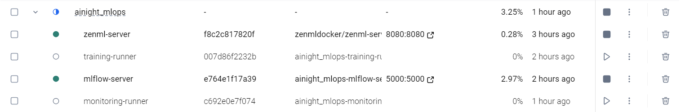

# OpenMLOps Challenge

A complete MLOps implementation for an end-to-end Computer Vision pipeline (CIFAR-10) using open-source tools. This repository includes data ingestion, model training, MLflow tracking, Evidenty monitoring, and ZenML orchestrating everything from within Docker.

## Architecture & Service Map

All services run inside a dedicated Docker bridge network (`mlops-network`). You can start everything with a single `docker compose up --build`.

| Service | Port | Description |
|---|---|---|
| `mlflow-server` | `5000` | Experiment Tracking and Model Registry UI. |
| `zenml-server` | `8080` | Pipeline orchestration backend and UI dashboard. |
| `training-runner` | `N/A` | One-shot container executing `src/pipelines/training_pipeline.py`. Runs steps 1-8. |
| `monitoring-runner` | `N/A` | One-shot container executing `src/pipelines/monitoring_pipeline.py`. Checks for data drift using Evidently. |

## Directory Structure

```text
openmlops-challenge/
├── .dvc/                   # DVC configuration and remote settings
├── data/                   # Raw and processed datasets (DVC-tracked)
├── docker/                 # Dockerfiles and wait-for-it.sh entrypoint
├── models/                 # Exported ONNX models (DVC-tracked)
├── reports/                # Generated Evidently HTML drift reports
├── requirements/           # Python dependencies (training.txt, monitoring.txt)
├── screenshots/            # Demonstration screenshots
├── src/
│   ├── models/             # PyTorch CNN architecture
│   ├── pipelines/          # ZenML pipelines (training, monitoring)
│   └── steps/              # ZenML steps (ingest, train, eval, evidently, etc)
├── .env.example            # Example environment variables
├── docker-compose.yml      # Multi-container orchestration
└── README.md               # Project documentation
```

## Prerequisites

- **Docker** and **Docker Compose** installed.
- **Git** and **DVC** installed (`pip install dvc[s3]`).
- An **AWS Account** with an S3 bucket (for DVC remote storage) (I Personnaly used a AWS Learners Lab so i faced some issues).

## Quick Start (Local End-to-End Test)

Follow these exact steps to reproduce the entire environment locally:

### 1. Clone & Configure
```bash
git clone <your-repo-url>
cd openmlops-challenge
cp .env.example .env
```
*Edit `.env` and fill in your AWS credentials and S3 bucket name.*

### 2. DVC Setup (Data Versioning)
If this is a fresh clone, you need to pull the data from S3:
```bash
dvc pull
```

### 3. Start the Infrastructure
```bash
docker compose up --build -d mlflow-server zenml-server
```
- Wait ~15 seconds for the services to become healthy.
- Verify MLflow UI at: [http://localhost:5000](http://localhost:5000)
- Verify ZenML UI at: [http://localhost:8080](http://localhost:8080) (default credentials: `admin` / `admin`)

### 4. Run the Training Pipeline
```bash
docker compose run --rm training-runner
```
*This will execute the 8-step training pipeline (Ingest → Validate → Preprocess → Split → Train → Evaluate → Register → Export). Check MLflow at port 5000 to see the tracked metrics, parameters, confusion matrix artifact, and the staged model in the Model Registry.*

### 5. Run the Monitoring Pipeline
```bash
# Test without drift (clean data)
docker compose run --rm monitoring-runner

# Test with simulated drift (triggers retraining)
USE_DRIFTED_DATA=true docker compose run --rm monitoring-runner
```
*This runs the 4-step monitoring pipeline. It generates an Evidently HTML report in the `reports/` folder. If `USE_DRIFTED_DATA=true` is set, it simulates a drift condition using Gaussian noise on the inference data, forcing an alert and programmatic retraining trigger.*

## Pipelines Overview

### Training Pipeline (`training_pipeline.py`)
1. **`ingest_data`**: Downloads CIFAR-10 via torchvision.
2. **`validate_data`**: Enforces strict schema validations (shape, dtype, NaN checks).
3. **`preprocess`**: Normalizes and augments the imagery.
4. **`split_data`**: Stratified train/val/test splits (70/15/15).
5. **`train_model`**: Trains a PyTorch CNN, logging epochs/loss to MLflow.
6. **`evaluate_model`**: Computes F1, Accuracy, and exports a confusion matrix.
7. **`register_model`**: Saves and transitions the model to `Staging` in MLflow Registry.
8. **`export_model`**: Exports the model as `.onnx` for downstream serving.

### Monitoring Pipeline (`monitoring_pipeline.py`)
1. **`collect_inference_data`**: Loads real or synthetic/drifted production inputs.
2. **`run_evidently_report`**: Compares current data distributions vs. reference data using `evidently`.
3. **`trigger_decision`**: Parses the JSON report for `dataset_drift`.
4. **`store_monitoring_artifacts`**: Saves the human-readable HTML report to the host `reports/` volume and logs it to MLflow artifacts.

## Screenshots

### Training Pipeline MLflow Tracking


### S3 Bucket Data Versioning


### Docker Containers Setup

